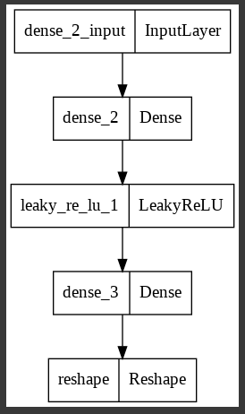
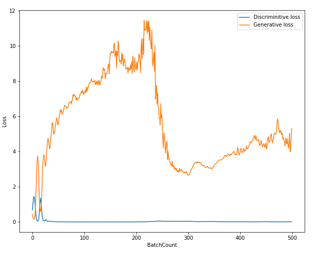
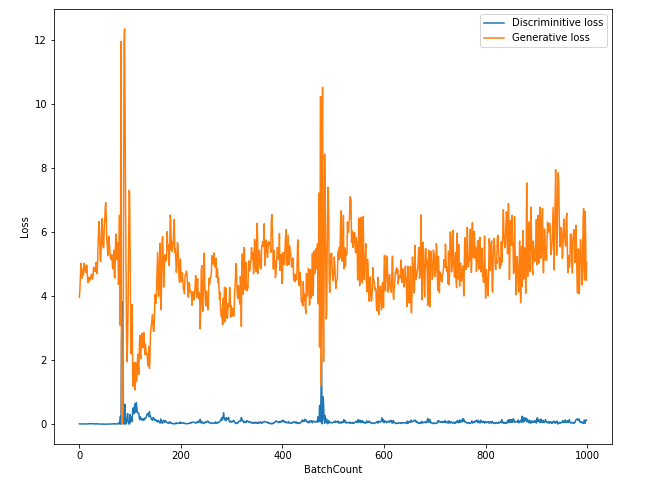
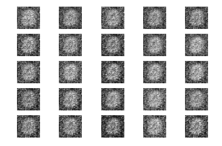
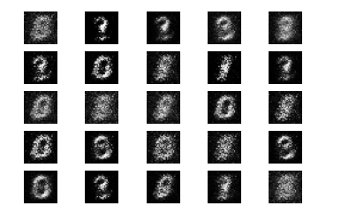

# Vanilla_GAN
Tensorflow implementation of GAN

## Requirements
* tensorflow 2.x
* python 3.x

## Core code
```python
def build_generator(img_shape, z_dim):
  model = Sequential()

  model.add(Dense(n_hidden, input_dim = z_dim)) # 인풋은 100 다음은 128개의 노드
  model.add(LeakyReLU(alpha = 0.01))
  model.add(Dense(28 * 28 * 1, activation="tanh")) # 128개의 노드 다음은 784개의 노드

  model.add(Reshape(img_shape))
  return model
  
def build_discriminator(img_shape):
  model = Sequential()

  model.add(Flatten(input_shape = img_shape)) # 이미지 모양대로 입력받아서 폄
  model.add(Dense(n_hidden))
  model.add(LeakyReLU(alpha=0.01))
  model.add(Dense(1, activation="sigmoid"))

  return model
```

## Model



## Training details (epoch < 500)

### loss



## Training details (epoch < 1000)

### loss


## Results
### epoch=500


### epoch=1000



## Author
SangBeom-Hahn
